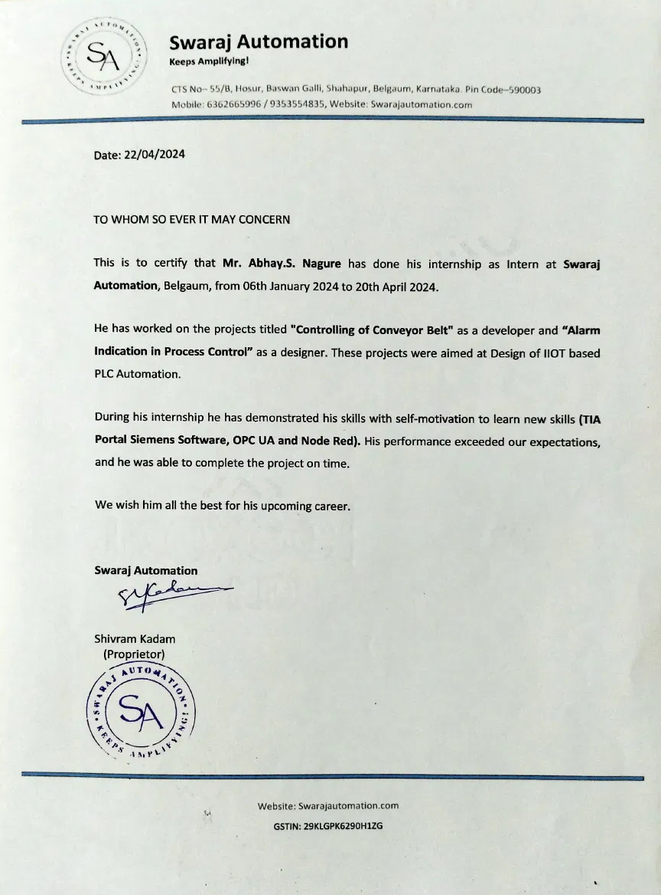

# Industrial Automation Internship

## About

This repository documents the concepts, tools, practical exercises, and automation projects explored during my **15-week Industrial Automation Internship** at **Swaraj Automation, Belagavi, Karnataka**, conducted from **06 January 2024 to 20 April 2024**.

The internship provided practical exposure to industrial automation systems used in manufacturing environments. The training covered Programmable Logic Controllers (PLCs), Siemens TIA Portal, Human Machine Interfaces (HMI), Industrial Communication Protocols, Industrial Internet of Things (IIoT), AWS IoT, OPC-UA, and Node-RED.

This repository serves as a technical reference for the topics studied, practical implementations, and project work completed during the internship.

---

# Internship Overview

| Item | Details |
|------|---------|
| **Organization** | Swaraj Automation |
| **Location** | Belagavi, Karnataka, India |
| **Internship Duration** | 06 January 2024 – 20 April 2024 (15 Weeks) |
| **Certificate Issued** | 22 April 2024 |
| **Role** | Industrial Automation Intern |
| **Academic Program** | Diploma in Electronics and Communication Engineering |
| **Projects Completed** | Controlling of Conveyor Belt (Developer), Alarm Indication in Process Control (Designer) |
| **Training Areas** | PLC Programming, Siemens TIA Portal, HMI, OPC-UA, AWS IoT, Node-RED |
| **Repository Purpose** | Technical documentation of concepts, practical exercises, and internship projects |

---

# Objectives

The primary objectives of this internship were to:

- Understand the fundamentals of Industrial Automation.
- Study the architecture and operation of Programmable Logic Controllers (PLCs).
- Learn PLC programming using Ladder Logic.
- Gain practical experience with Siemens TIA Portal.
- Understand Human Machine Interface (HMI) development.
- Explore Industrial Communication using OPC-UA.
- Study Industrial Internet of Things (IIoT) concepts using AWS IoT.
- Develop monitoring dashboards using Node-RED.
- Apply theoretical concepts through practical automation projects.

---

# Technologies and Tools

| Category | Technology |
|----------|------------|
| PLC | Siemens PLC |
| PLC Programming | Ladder Logic |
| Software | Siemens TIA Portal |
| Industrial Communication | OPC-UA |
| Cloud Platform | AWS IoT |
| Dashboard | Node-RED |
| Industrial Projects | Conveyor Belt Control, Alarm Indication, Hydraulic Press, Tank Mixing |

---

# Topics Covered

## Industrial Automation

- Introduction to Industrial Automation
- Industrial Control Systems
- Automation Architecture
- Industrial Applications

## Programmable Logic Controllers (PLC)

- PLC Architecture
- CPU
- Memory
- Input Modules
- Output Modules
- PLC Scan Cycle
- Digital Inputs
- Digital Outputs
- Analog Inputs
- Analog Outputs

## PLC Programming

- Ladder Logic
- Timers
- Counters
- Contacts
- Coils
- Internal Relays
- Ladder Logic Networks

## Siemens TIA Portal

- Project Configuration
- PLC Programming
- Program Download
- Online Monitoring
- Debugging

## Human Machine Interface (HMI)

- Industrial Visualization
- Machine Monitoring
- Operator Interface

## Industrial Communication

- OPC-UA
- Industrial Networking

## Industrial Internet of Things (IIoT)

- AWS IoT Core
- Device Registration
- Security Certificates
- MQTT Communication

## Node-RED

- Dashboard Development
- Industrial Data Monitoring
- Cloud Integration

---

# Internship Projects

## 1. Controlling of Conveyor Belt

**Role:** Developer

Developed PLC-based control logic for conveyor belt operation as part of an IIoT-enabled industrial automation system.

### Technologies

- Siemens PLC
- TIA Portal
- Ladder Logic

---

## 2. Alarm Indication in Process Control

**Role:** Designer

Designed an alarm indication system for process monitoring to improve operational safety and fault detection.

### Technologies

- PLC
- Node-RED
- OPC-UA

---

# Practical Training Modules

During the internship, practical exposure was also gained through the following automation exercises:

- Hydraulic Press Automation
- Automatic Tank Mixing System
- Ladder Logic Networks
- AWS IoT Integration
- Node-RED Dashboard Development

---

# Image Gallery

## PLC Control Panel

<p align="center">

</p>

---

## PLC Architecture

<p align="center">

</p>

---

## Ladder Logic Fundamentals

<p align="center">


</p>

---

## Siemens TIA Portal

<p align="center">

</p>

---

## OPC-UA Communication

<p align="center">

</p>

---

## Hydraulic Press Automation

<p align="center">

</p>

---

## Automatic Tank Mixing System

<p align="center">

</p>

---

## Ladder Logic Networks

<p align="center">


</p>

<p align="center">


</p>

<p align="center">


</p>

---

## Siemens Project

<p align="center">


</p>

---

## AWS IoT

<p align="center">


</p>

---

## Node-RED Dashboard

<p align="center">

</p>

---

## Web Dashboard

<p align="center">

</p>

---

# Key Learning Outcomes

- Developed a strong understanding of industrial automation systems.
- Learned PLC programming using Ladder Logic.
- Configured Siemens PLC projects using TIA Portal.
- Understood industrial communication using OPC-UA.
- Explored Industrial Internet of Things (IIoT) using AWS IoT.
- Developed industrial dashboards using Node-RED.
- Applied automation concepts through real-world industrial projects.
- Improved technical documentation and engineering workflow practices.

---

# Internship Certificate

The following certificate was issued by **Swaraj Automation** upon successful completion of the internship.

<p align="center">

</p>

---

# Repository Structure

```
Industrial-Automation-Internship/
│
├── Images/
│   ├── Industrial_IoT/
│   ├── PLC/
│   ├── Projects/
│   ├── Siemens/
│   └── Internship_Certificate.jpeg
│
├── README.md
├── LICENSE
└── .gitignore
```

---

# References

- Siemens TIA Portal Documentation
- AWS IoT Core Documentation
- OPC Foundation Documentation
- Node-RED Documentation
- Industrial Automation Training Material

---

# Author

**Abhay Nagure**

Bachelor of Engineering (Electronics and Communication Engineering)

## Areas of Interest

- Industrial Automation
- Embedded Systems
- PLC Programming
- Industrial Internet of Things (IIoT)
- Control Systems
- Industrial Communication
